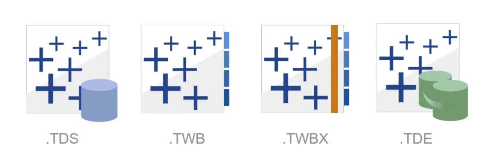
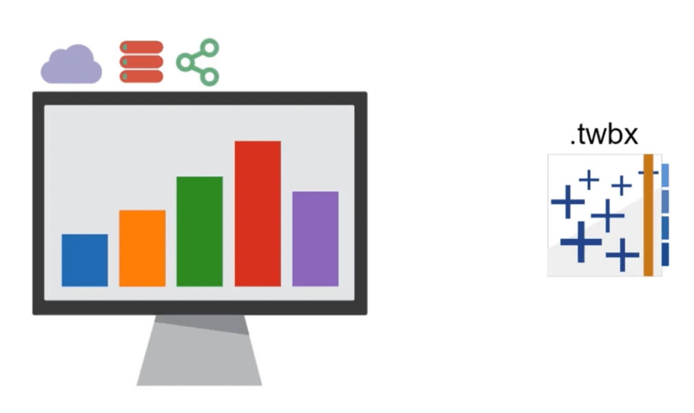
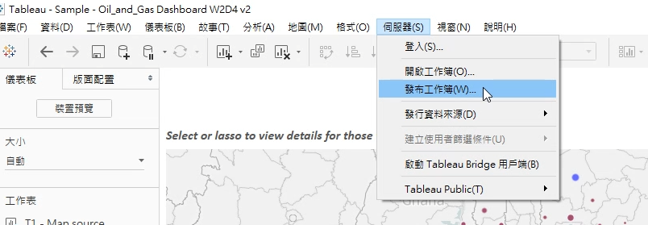
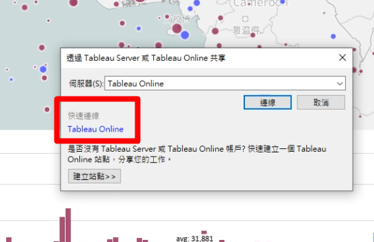
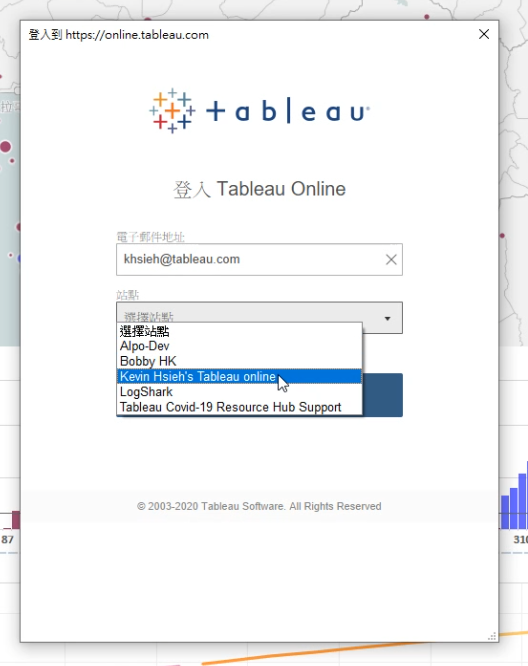
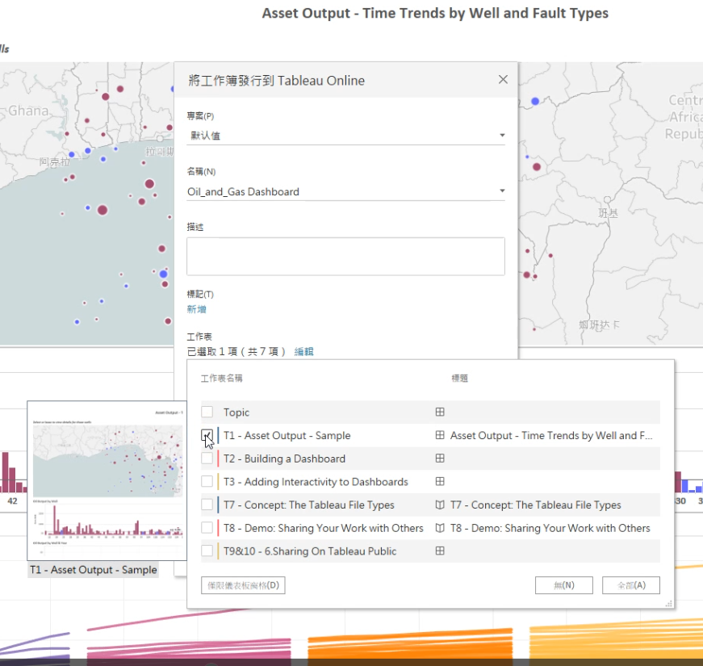
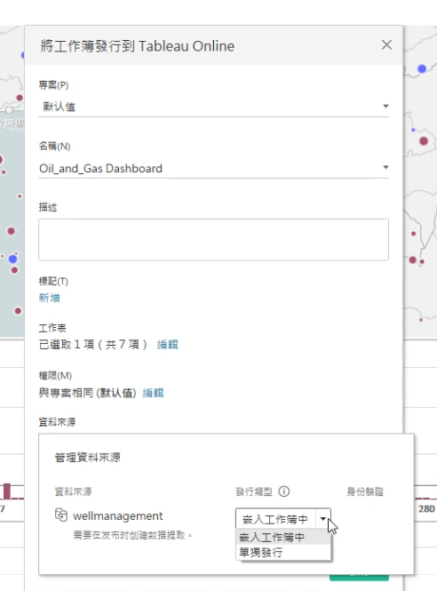
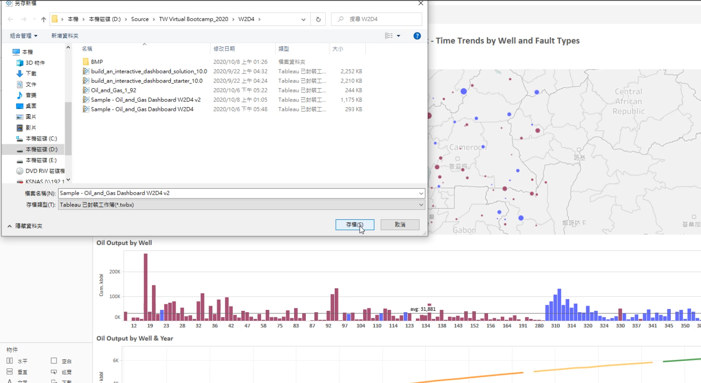
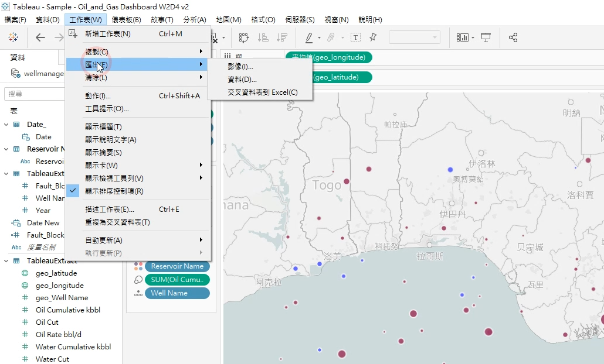
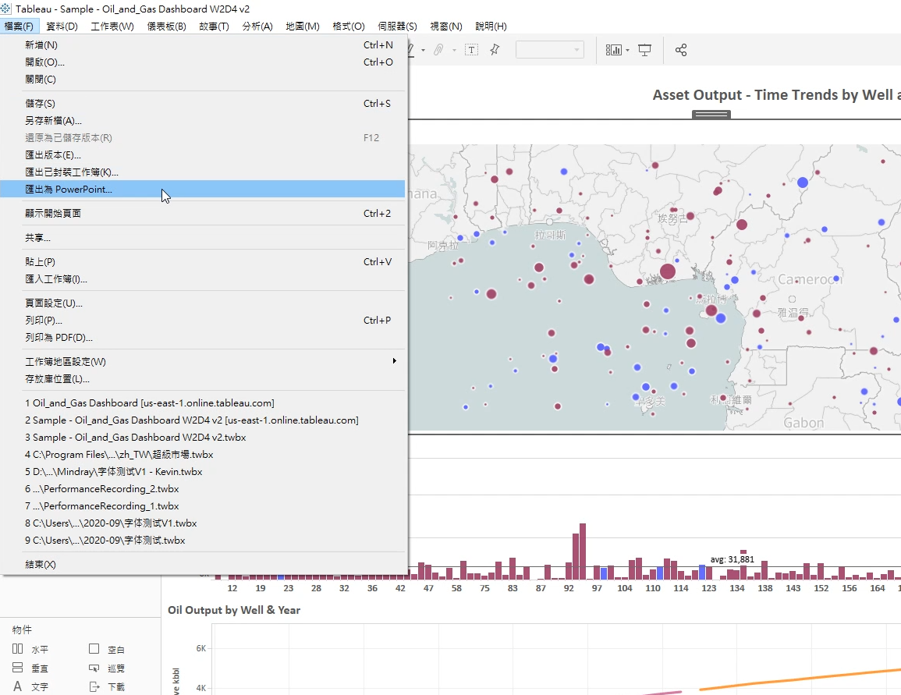

Tableau支援輸出4種格式：

可以分享到官方雲端Online or 自架雲端Server：

也可以分享到Public：

或者將工作簿打包成.twbx後，讓其他人用Tableau Reader閱讀：

---

選擇個人的站點：

可以只發布選定的工作表：

如果管理資料來源選擇單獨發行，資料來源也會被共享出去，所以如果要隱藏的話就選嵌入工作簿：

---

如果想讓人用local的Tableau Reader閱讀，就輸出成將資料來源也封裝在一起的.twbx檔：

也可以匯出單一工作表為圖像：

也可以匯出整個儀表板成Powerpoint：

也可以輸出成Microsoft Access DB 或 Excel等...
