先建立表：

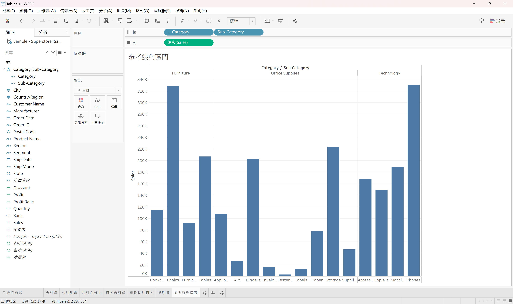

目標：建立參考線顯示Profit（不是Sales）平均

顯示Profit詳細資料：

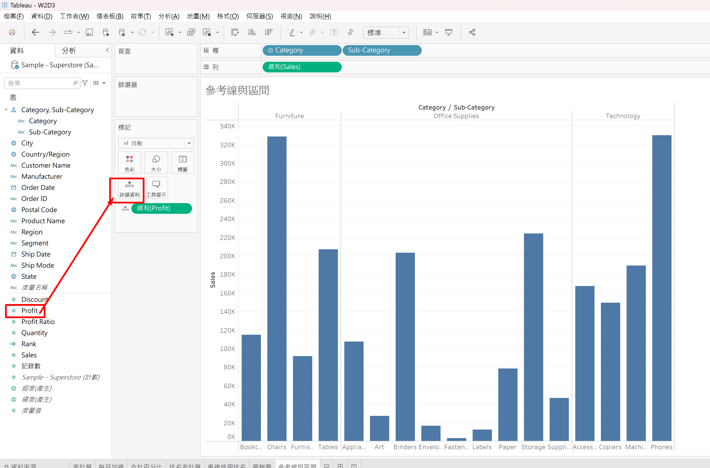

---

新增每個窗格的平均Profit參考線：

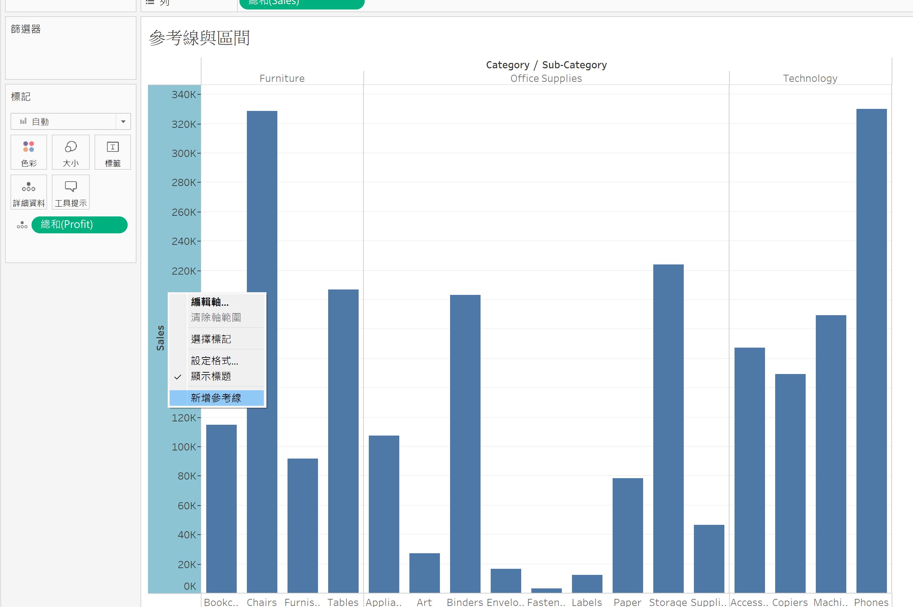
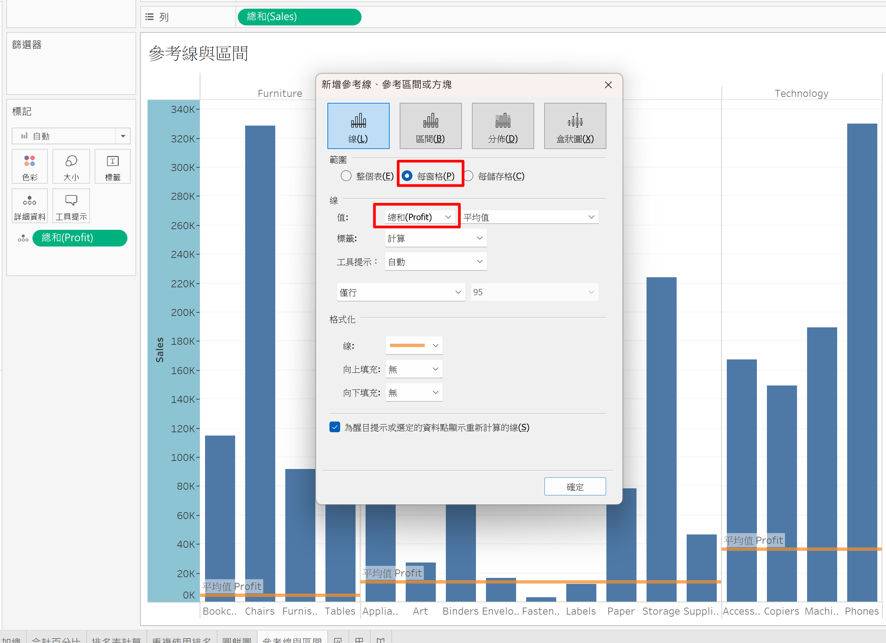

參考線顯示值：

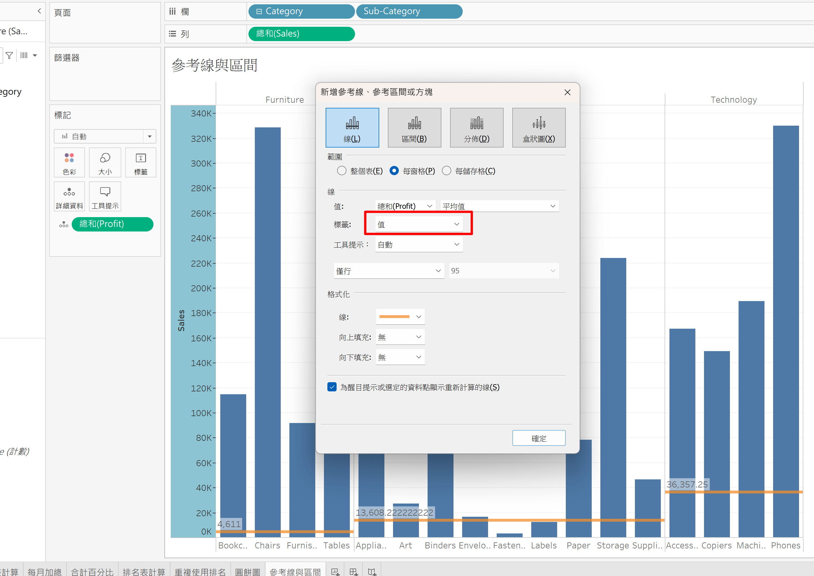

也可以從這裡新增參考線：

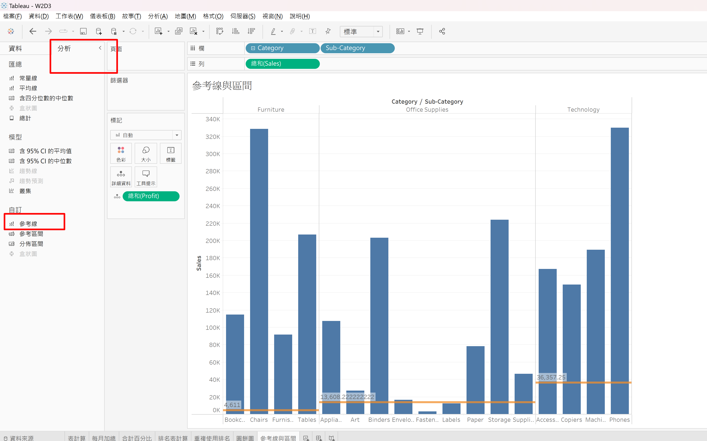

再增加一個佔整個表的Profit平均參考線：

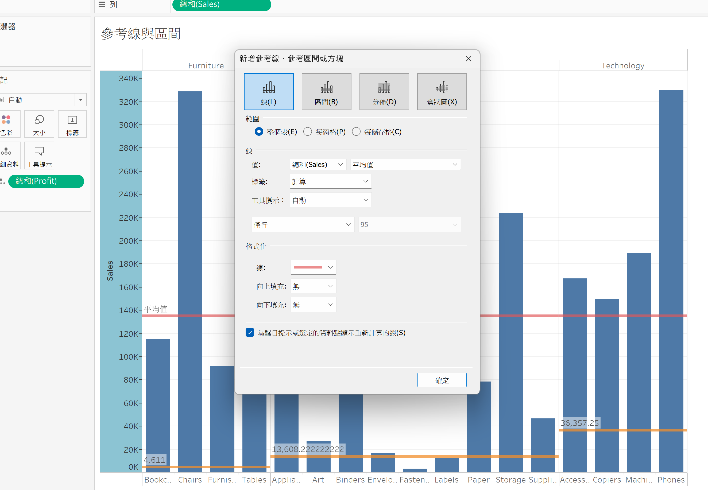

當只Highlight表部份的內容時，參考線也會依據選取的內容重計算：

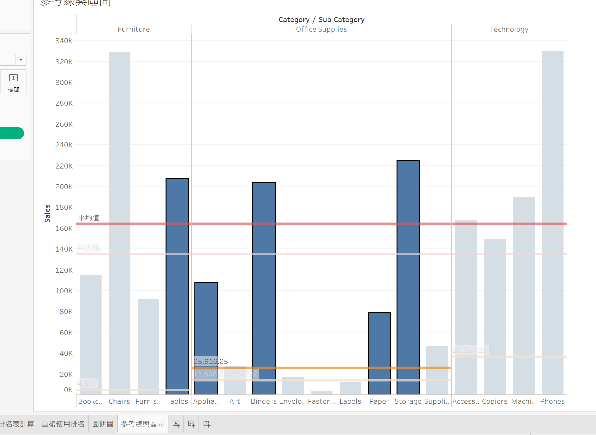

也可以在編輯參考線的視窗中把此checkbox關掉，就不會在Hightlight時重新計算：

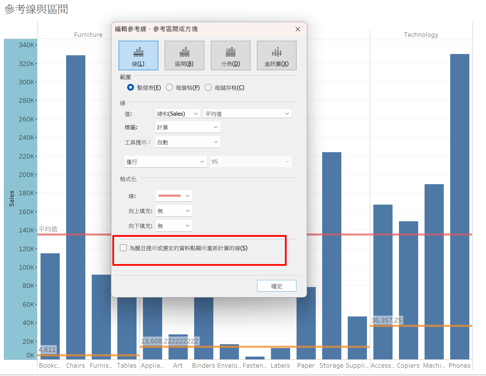

---

建立一個整個表平均值～最大值的參考區間：

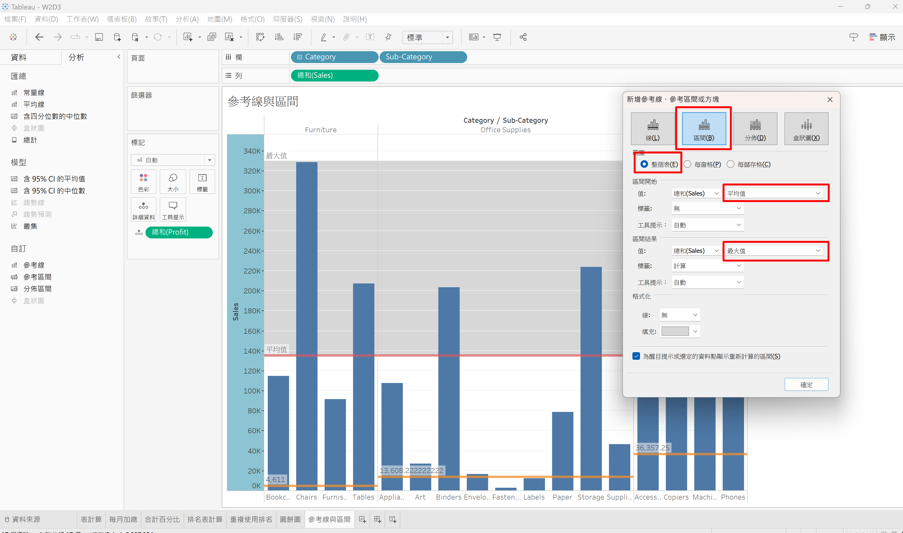

建立四分位數參考分佈：

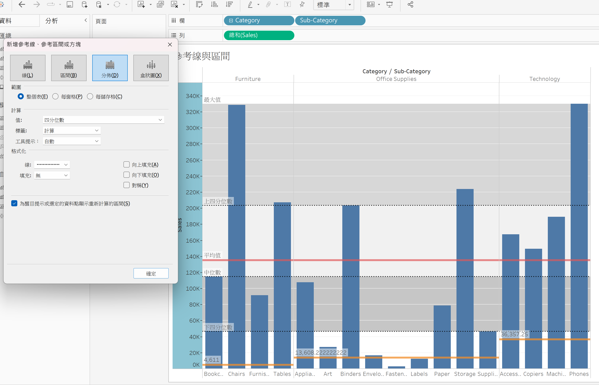
