先做好設定：

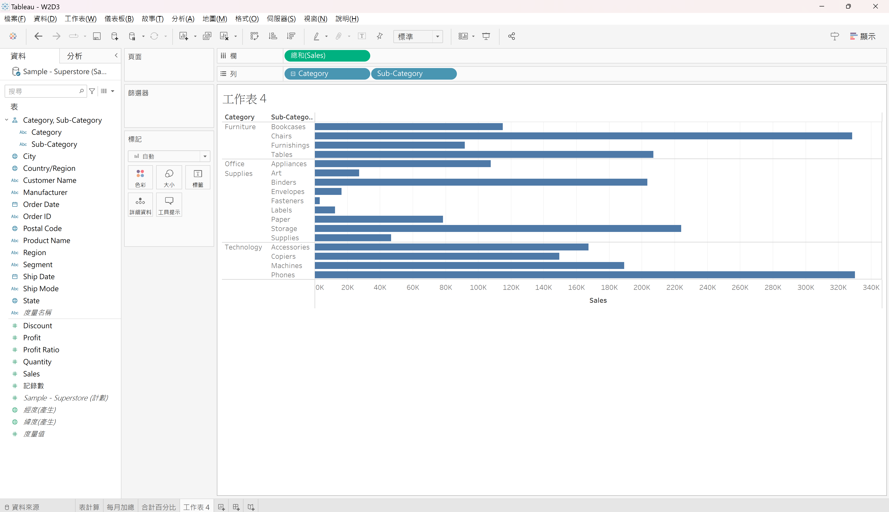
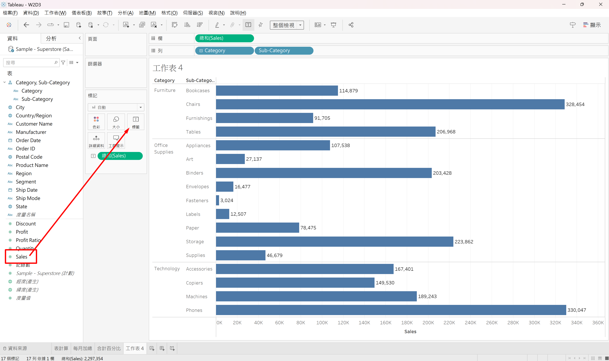

顯示基本排名（依據整個表作排名）：

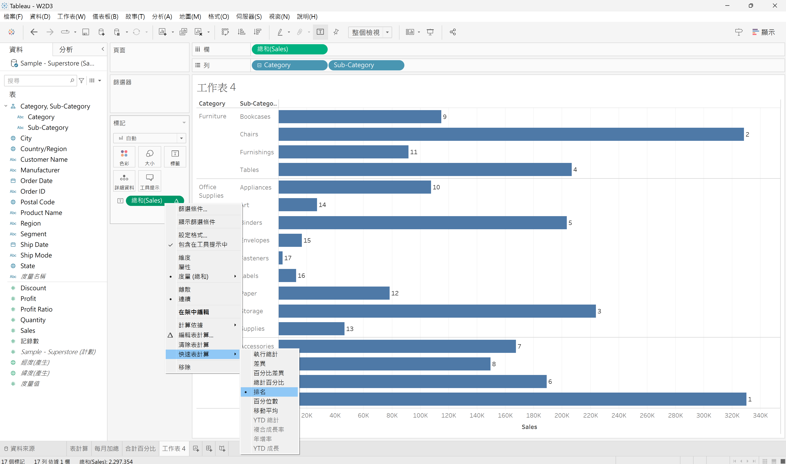

改以窗格排名：

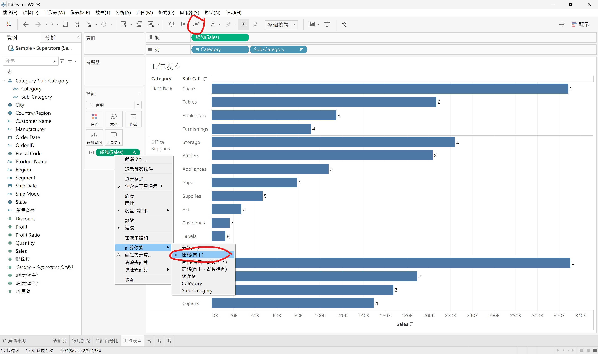

---

更改排名方式：

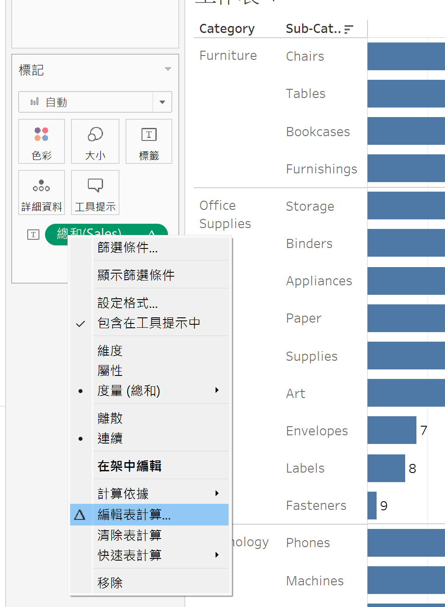

---

若要將排名以標題形式呈現，就不能用連續的Sales總和(連續資料會以軸的形式呈現)。要改成離散再拉到列：

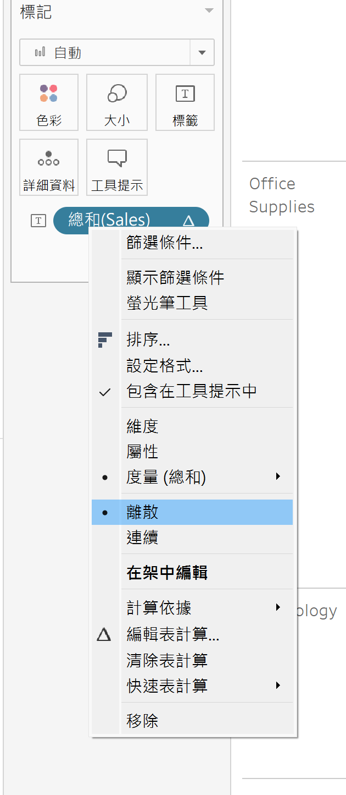
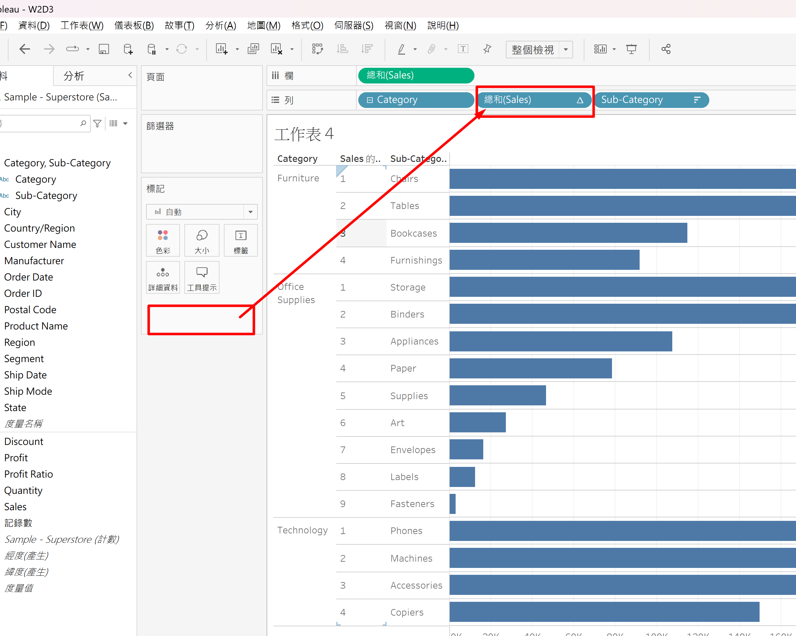

---

將排名欄位轉成可重複使用的欄位：

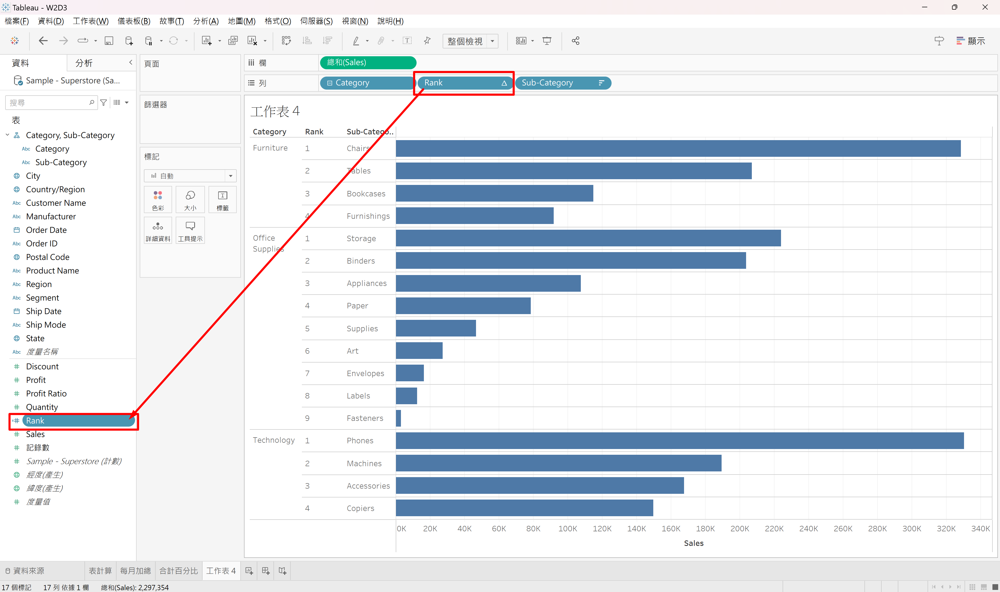
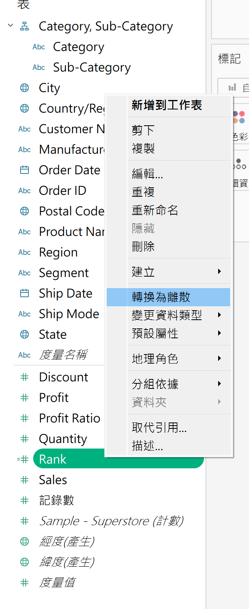

可以看到轉換成可重複使用欄位後，其代表指令：

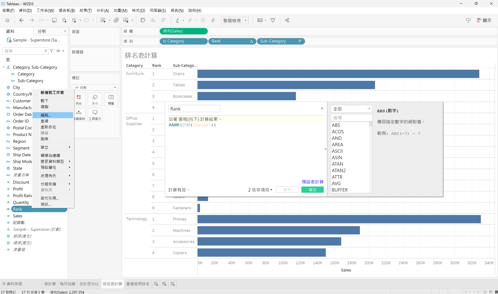

將手動設定的可重複使用欄位"Rank"套用到別的工作表範例：

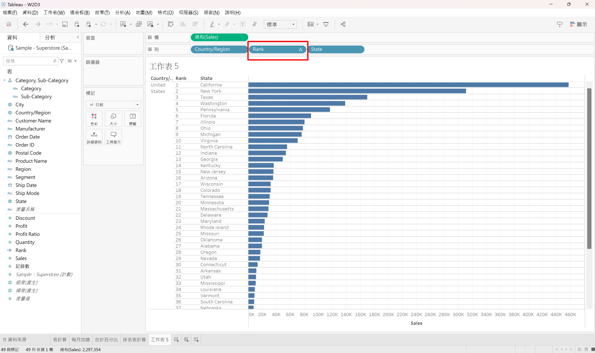
