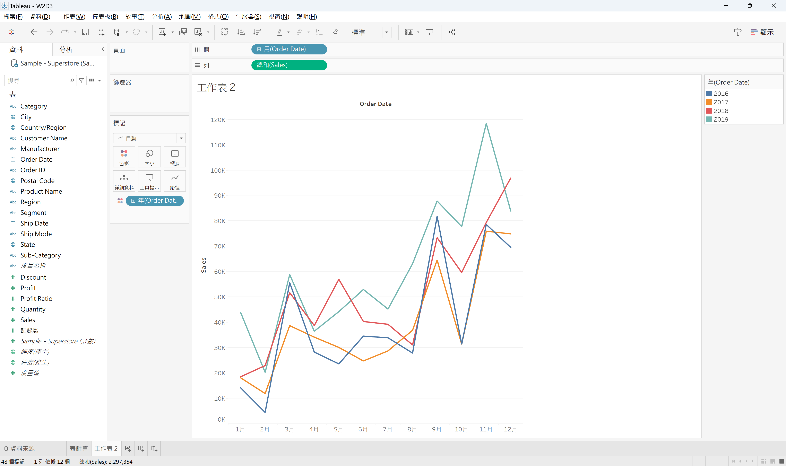
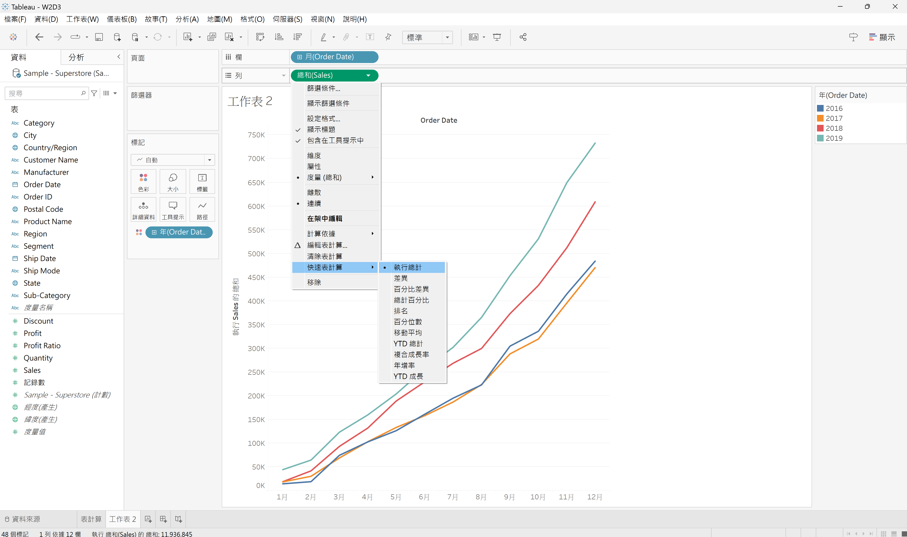
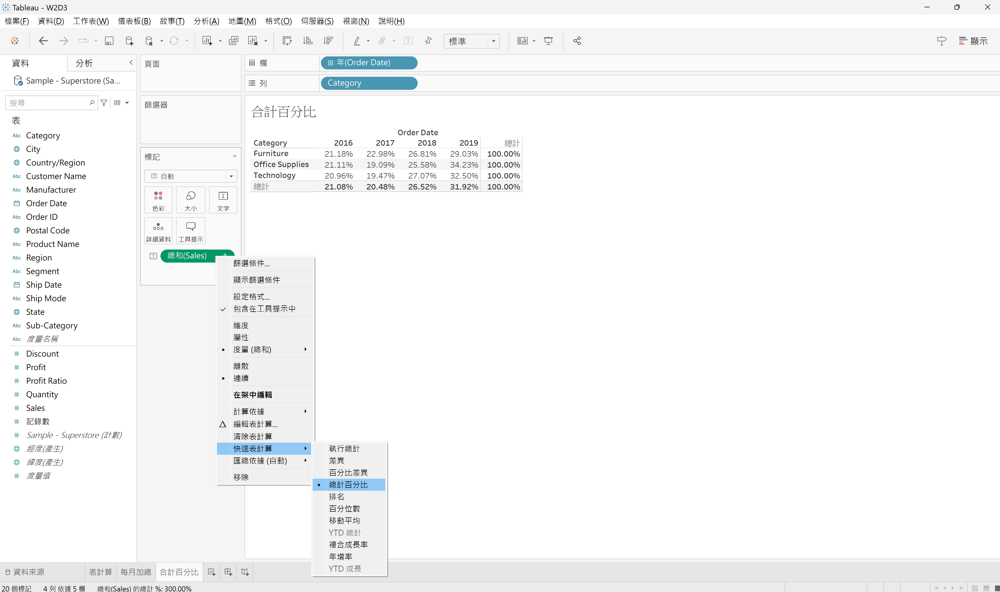
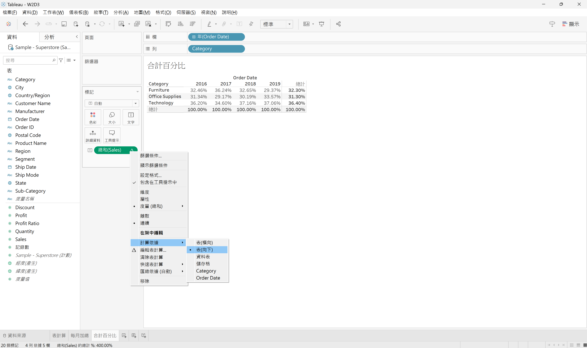
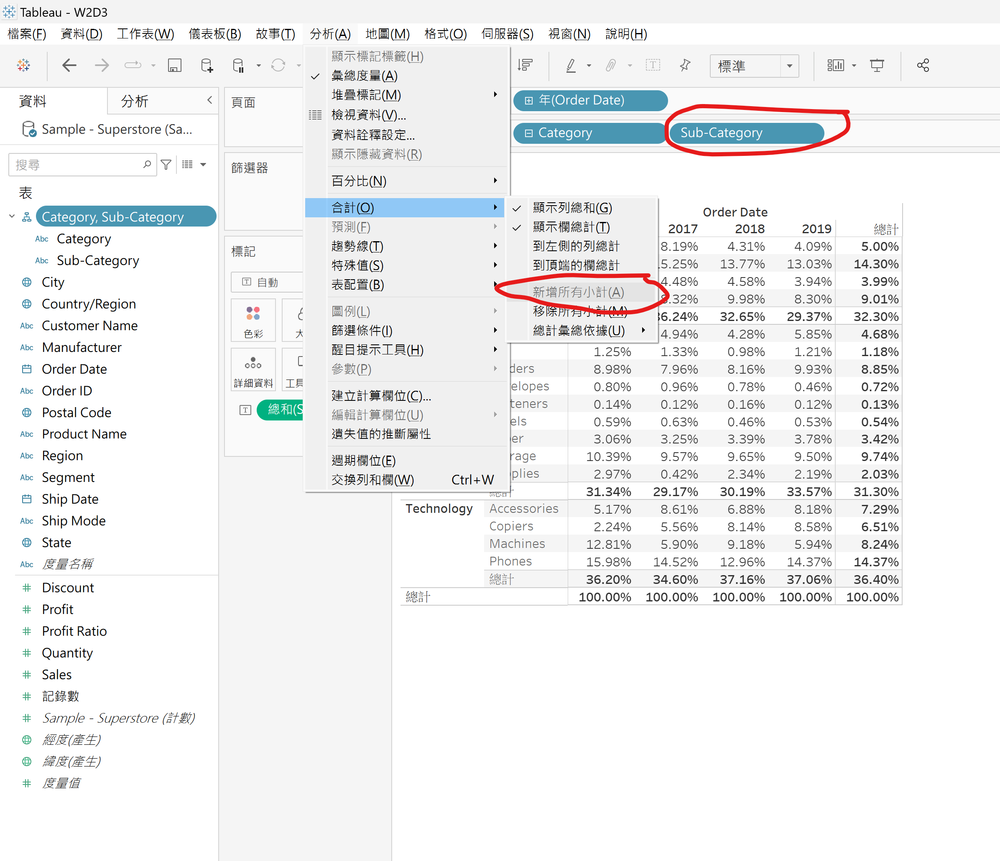
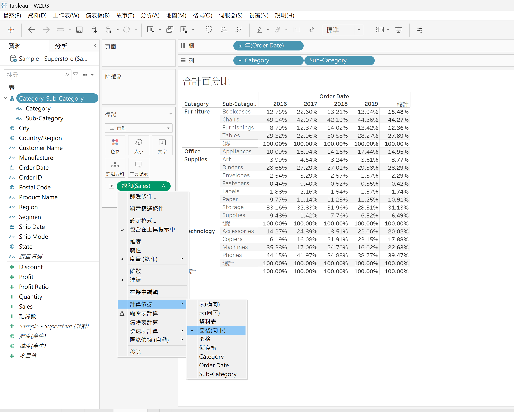

先做好基本設定：

此能進行累計加總的表計算（會由左到右累加）：

此能改成由上至下累加計算：

此能讓每行（直向）會包含上一行的加總做累加：

---

下個範例，設定如下：

此能進行每月包含上月的加總：

---

### 合計百分比

顯示每年占總計的百分比：

改成向下計算，就能以年為依據算百分比，而不是以產品類別計算：

再看更細，增加Sub-Category列，並再點選"新增所有小計"以讓每個窗格也有顯示總計：

計算依據改成以窗格向下，這樣每個窗格的總計都是累加到100%：

